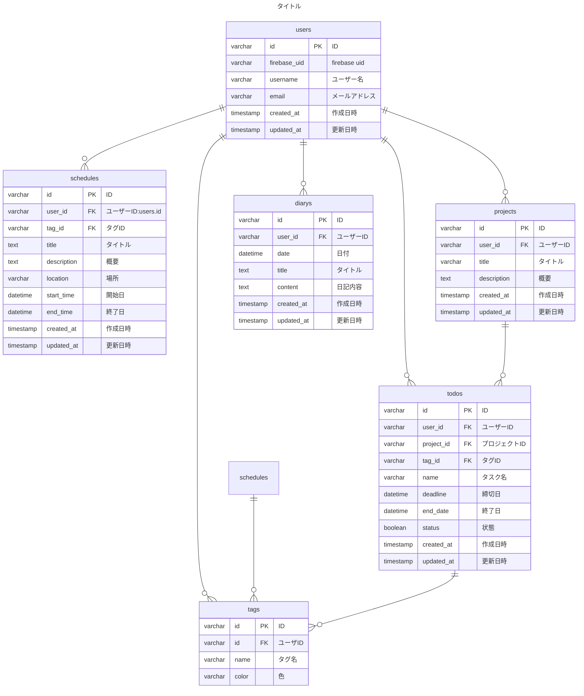

# ER 図

## データベース

```mermaid
---
title: "タイトル"
---
erDiagram
    users ||--o{ schedules : ""
    users ||--o{ projects : ""
    users ||--o{ todos : ""
    users ||--o{ diarys : ""
    users ||--o{ tags : ""

    projects ||--o{ todos : ""

    schedules　||--o{ tags : ""
    todos ||--o{ tags : ""


    users {
      varchar id PK "ID"
      varchar firebase_uid "firebase uid"
      varchar username "ユーザー名"
      varchar email "メールアドレス"
      timestamp created_at "作成日時"
      timestamp updated_at "更新日時"
    }

    schedules {
      varchar id PK "ID"
      varchar user_id FK "ユーザーID:users.id"
      varchar tag_id FK "タグID"
      text title "タイトル"
      text description  "概要"
      varchar location "場所"
      datetime start_time  "開始日"
      datetime end_time "終了日"
      timestamp created_at "作成日時"
      timestamp updated_at "更新日時"
    }

    projects {
      varchar id PK "ID"
      varchar user_id FK "ユーザーID"
      varchar title "タイトル"
      text description "概要"
      timestamp created_at "作成日時"
      timestamp updated_at "更新日時"
    }

    todos {
      varchar id PK "ID"
      varchar user_id FK "ユーザーID"
      varchar project_id FK "プロジェクトID"
      varchar tag_id FK "タグID"
      varchar name "タスク名"
      datetime deadline "締切日"
      datetime end_date "終了日"
      boolean status "状態"
      timestamp created_at "作成日時"
      timestamp updated_at "更新日時"
    }

    tags {
      varchar id PK "ID"
      varchar id FK "ユーザID"
      varchar name "タグ名"
      varchar color "色"
    }

    diarys {
      varchar id PK "ID"
      varchar user_id FK "ユーザーID"
      datetime date  "日付"
      text title "タイトル"
      text content "日記内容"
      timestamp created_at "作成日時"
      timestamp updated_at "更新日時"
    }
```
